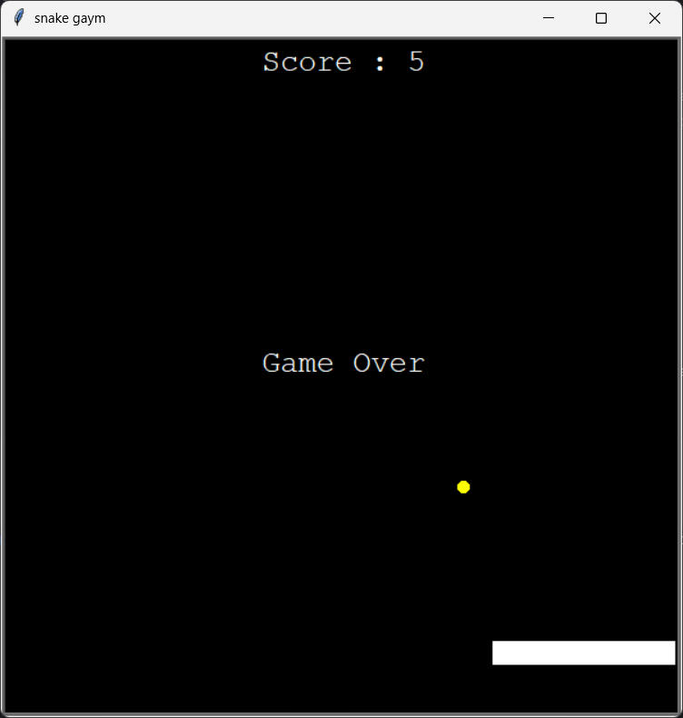

# 🐍 Snake Game in Python (Turtle Module)

This is a simple **Snake Game** built using Python's `turtle` module. It features a growing snake, collision detection, and a real-time score counter.

---

## 🎮 Game Features

- ✅ Real-time score counter
- ✅ Collision with food and self
- ✅ Snake growth mechanics
- ✅ Game Over screen
- ✅ Built entirely using `turtle` — no external game engines

---

## 📸 Screenshots

| Game Over |
|----------|-----------|



---

### 📹 Video Demo

https://github.com/user-attachments/assets/f682156f-824e-40de-83f9-9722dcf3413e


## 🛠️ Requirements

- Python 3.x
- `turtle` module (pre-installed with Python)

---

## 🚀 How to Run

1. Clone or download this repository.
2. Open `snake_game.py` in any Python IDE or terminal.
3. Run the file:
   ```bash
   python snake_game.py
   ```

Use arrow keys to control the snake:

⬆️ Up

⬇️ Down

⬅️ Left

➡️ Right


